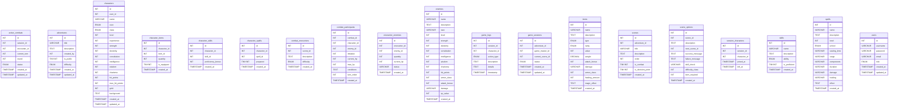

# Modelo Entidad-Relación de la Base de Datos RolPlayer

```mermaid
erDiagram
    active_combats {
        INT id
        INT session_id
        INT encounter_id
        INT current_turn
        INT round
        ENUM status
        TIMESTAMP created_at
        TIMESTAMP updated_at
    }

    adventures {
        INT id
        VARCHAR title
        TEXT description
        INT created_by
        TINYINT is_public
        ENUM difficulty
        TIMESTAMP created_at
        TIMESTAMP updated_at
    }

    characters {
        INT id
        INT user_id
        VARCHAR name
        ENUM race
        ENUM class
        INT level
        INT experience
        INT strength
        INT dexterity
        INT constitution
        INT intelligence
        INT wisdom
        INT charisma
        INT hit_points
        INT max_hit_points
        INT gold
        TEXT background
        TIMESTAMP created_at
        TIMESTAMP updated_at
    }

    character_items {
        INT id
        INT character_id
        INT item_id
        INT quantity
        TINYINT is_equipped
        TIMESTAMP created_at
    }

    character_skills {
        INT id
        INT character_id
        INT skill_id
        INT proficiency_bonus
        TIMESTAMP created_at
    }

    character_spells {
        INT id
        INT character_id
        INT spell_id
        TINYINT prepared
        TIMESTAMP created_at
    }

    combat_encounters {
        INT id
        INT scene_id
        TEXT description
        ENUM difficulty
        TIMESTAMP created_at
    }

    combat_participants {
        INT id
        INT combat_id
        INT character_id
        INT enemy_id
        INT initiative
        INT current_hp
        INT max_hp
        TEXT conditions
        INT turn_order
        TIMESTAMP created_at
    }

    encounter_enemies {
        INT id
        INT encounter_id
        INT enemy_id
        INT quantity
        INT current_hp
        VARCHAR status
        TIMESTAMP created_at
    }

    enemies {
        INT id
        VARCHAR name
        TEXT description
        VARCHAR race
        INT level
        INT strength
        INT dexterity
        INT constitution
        INT intelligence
        INT wisdom
        INT charisma
        INT hit_points
        INT armor_class
        INT attack_bonus
        VARCHAR damage
        INT xp_value
        TIMESTAMP created_at
    }

    game_logs {
        INT id
        INT session_id
        INT character_id
        ENUM action_type
        TEXT description
        TEXT details
        TIMESTAMP timestamp
    }

    game_sessions {
        INT id
        INT adventure_id
        INT game_master_id
        INT current_scene_id
        ENUM status
        TIMESTAMP created_at
        TIMESTAMP updated_at
    }

    items {
        INT id
        VARCHAR name
        TEXT description
        ENUM type
        ENUM rarity
        INT value
        DECIMAL weight
        INT attack_bonus
        VARCHAR damage
        INT armor_class
        INT healing_amount
        TEXT magic_effect
        TIMESTAMP created_at
    }

    scenes {
        INT id
        INT adventure_id
        VARCHAR title
        TEXT description
        INT order
        TINYINT is_combat
        TINYINT is_decision_point
        TIMESTAMP created_at
    }

    scene_options {
        INT id
        INT scene_id
        TEXT description
        INT next_scene_id
        TEXT success_message
        TEXT failure_message
        VARCHAR skill_check
        INT difficulty_class
        INT item_required
        TIMESTAMP created_at
    }

    session_characters {
        INT id
        INT session_id
        INT character_id
        TIMESTAMP joined_at
        TIMESTAMP left_at
    }

    skills {
        INT id
        VARCHAR name
        TEXT description
        ENUM ability
        TINYINT is_proficient
        TIMESTAMP created_at
    }

    spells {
        INT id
        VARCHAR name
        TEXT description
        INT level
        ENUM school
        VARCHAR casting_time
        VARCHAR range
        VARCHAR components
        VARCHAR duration
        VARCHAR damage
        VARCHAR healing
        TEXT effect
        TIMESTAMP created_at
    }

    users {
        INT id
        VARCHAR username
        VARCHAR password
        VARCHAR email
        ENUM role
        TIMESTAMP created_at
        TIMESTAMP updated_at
    }

```